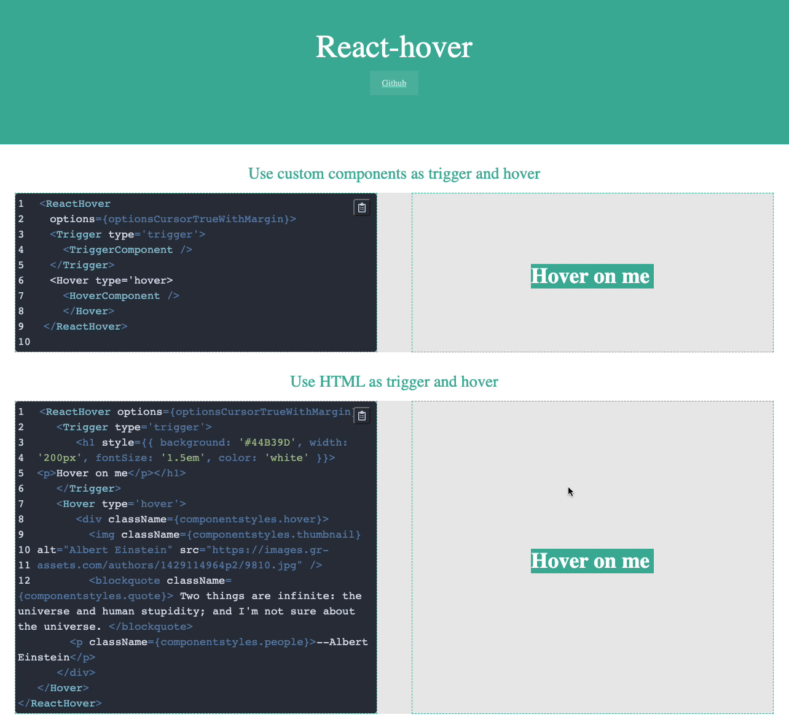

[](https://gitter.im/cht8687/react-hover?utm_source=badge&utm_medium=badge&utm_campaign=pr-badge&utm_content=badge)

<big><h1 align="center">React Hover --- Turn anything to a 'hoverable' object</h1></big>

<p align="center">
  <a href="https://circleci.com/gh/cht8687/react-hover">
    
  </a>

  <a href="https://www.npmjs.com/package/react-hover">
    
  </a>

 <a href="https://coveralls.io/github/cht8687/react-hover?branch=master">
    
 </a>

  <a href="https://travis-ci.org/cht8687/react-hover">
    
  </a>

  <a href="https://npmjs.org/package/react-hover">
    
  </a>

  <a href="https://david-dm.org/cht8687/react-hover.svg">
    
  </a>

  <a href="https://github.com/cht8687/react-hover/blob/master/LICENSE">
    
  </a>
</p>

<p align="center"><big>

</big></p>



## Installation

### npm

```
$ npm install --save react-hover
```

## Demo

[Demo](http://cht8687.github.io/react-hover/example/)

## Example code

[Code Example](https://github.com/cht8687/react-hover/blob/master/src/example/Example.js)

## Usage

You can turn plain HTML or your custom trigger/hover components in React-hover.

Below is the example of custom components:

```js
<ReactHover options={optionsCursorTrueWithMargin}>
  <Trigger type="trigger">
    <TriggerComponent />
  </Trigger>
  <Hover type="hover">
    <HoverComponent />
  </Hover>
</ReactHover>
```

Or plain HTML element:

```js
<ReactHover options={optionsCursorTrueWithMargin}>
  <Trigger type="trigger">
    <h1 style={{ background: '#abbcf1', width: '200px' }}> Hover on me </h1>
  </Trigger>
  <Hover type="hover">
    <h1> I am hover HTML </h1>
  </Hover>
</ReactHover>
```

## Options

#### `options`: PropTypes.object.isRequired

Set the options.

```js
const options = {
  followCursor: true,
  shiftX: 20,
  shiftY: 0,
}
```

`followCursor`: define if hover object follow mouse cursor
`shiftX`: left-right shift the hover object to the mouse cursor
`shiftY`: up-down shift the hover object to the mouse cursor

## type

#### `type`: PropTypes.string

Set the type.

```js

<Trigger type='trigger'>
<Hover type='hover'>

```

This prop defines the type name. It must be declared as above if you minify your code in production.

## Development

```
$ git clone git@github.com:cht8687/react-hover.git
$ cd react-hover
$ npm install
$ npm run dev
```

Then

```
open http://localhost:8080/webpack-dev-server/
```

## Want to buy me a coffee?

[](https://ko-fi.com/X8X71IORB)

## License

MIT

## Contributors

Thanks to these wonderful developers for helping this project:

<p float="left">
    <a href="https://github.com/illiteratewriter"></a>
    <a href="https://github.com/simPod"></a>
    <a href="https://github.com/bucketsec"></a>
</p>
